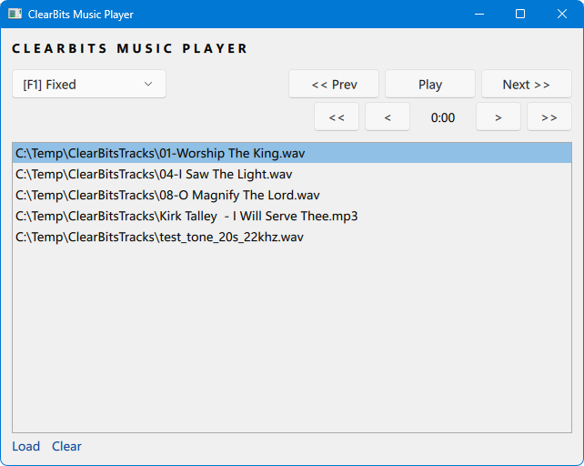
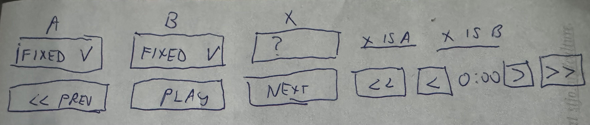

# ClearBits Music Player

 
ClearBits Music Player (the new Qt version)

## Welcome
ClearBits is a technique that varies audio buffer sizes during playback in order to explore whether such changes may affect the perceived sound quality of audio.

The ClearBits Music Player (ClearBitsQt.exe) is a Windows-based audio player app that allows enabling and disabling of the ClearBits technique while playing the user's choice of WAVE / MP3 audio files and to easily seek within them.  It is intended to allow users to evaluate the ClearBits effect for for themselves using familiar and repeatable audio sources.

Please see the [home page](https://dcsoft.com/products/clearbits) for full information.  NOTE:  The original ClearBits described on the home page will soon be replaced with the Qt version.

&nbsp;

## Next Step:  Add ABX functionality into the ClearBits Music Player

Listeners who perceive a difference in casual listening may not always demonstrate statistically significant results in ABX testing.  ClearBits is particularly well suited to ABX-style listening because the effect can be engaged or disengaged during continuous playback of the same audio stream.

This avoids the need to synchronize multiple audio streams and ensures time and level alignment when switching between conditions, reducing the listener's reliance on short-term auditory memory.  At the same time, it allows the listener to control pacing, repeat passages, and explore both short and longer listening intervals.

To ensure that the transition itself does not reveal which mode is active, switching conditions briefly mute playback, reposition to a recent (or optionally user-selected fixed) point within the same passage, and resume playback, allowing repeated comparison of identical musical context under different conditions.

Because the new buffer behavior takes effect almost immediately, the listener can evaluate differences without requiring long settling periods.

Overall, ClearBits provides a simple and practical way to explore whether differences are perceptible under controlled yet natural listening conditions.  For this reason, adding ABX functionality allows listeners to evaluate whether perceived differences can be detected reliably under controlled comparison.

### Initial UI

It is straightforward and simple to re-arrange the existing player controls to make room for a few new ones.

* Add a row of "A", "B", "X" labels at the very top
* The first combobox already exists and becomes "A".  Add a second combobox for "B".  Add a button for "X"
* Clicking the "A", anywhere in the first combobox or typing keyboard shortcut "A" activates that randomness.
  * Ditto for "B" and the second combobox.
* CLicking the 'X" button or typing keyboard shortcut "X" activates that.
* Clicking "X is A" or "X is "B" shows a message box popup:
  * Whether it is correct
  * e.g. "3 of 5" results are correct
  * Links
    * Reset X <-- randomly re-assigns X to either A or B
    * New Test <-- resets count of correct and attempts shown above (e.g. sets above "3 of 5" to "0 of 0" before next answer is recorded)
* Move the Prev/Play/Next next to the Seek buttons

### Sample UI

Here is more complete potential UI for the ABX extension.

An ABX test presents the user with three audio samples: a known A, a known B, and an unknown X that is secretly either A or B. The listener's job is not to judge which they prefer, but to correctly identify whether X matches A or B. This is repeated across multiple trials (typically 10) to build statistical confidence.

*Key UI Regions*

* Playback controls — Three clearly labeled buttons: Play A, Play B, and Play X. The user can switch between them freely as many times as needed before deciding.

* Waveform / progress bar — Shows the current playback position, keeping both samples time-synced so the listener can compare the same musical passage.

* Trial tracker — Dot indicators showing current trial number (e.g., "Trial 3 of 10") so the user knows their progress through the test session.

* Decision buttons — Two prominent buttons labeled X = A and X = B to submit the answer for the current trial.

* Running statistics — A live summary panel showing correct answers, incorrect answers, remaining trials, and a confidence percentage (derived from binomial probability).
